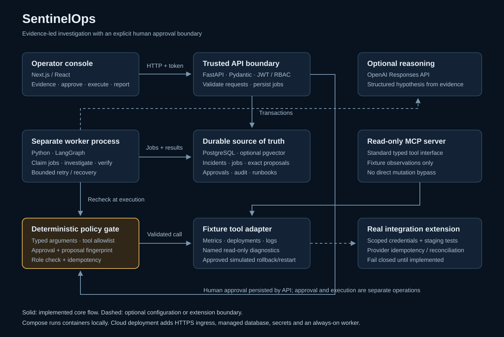
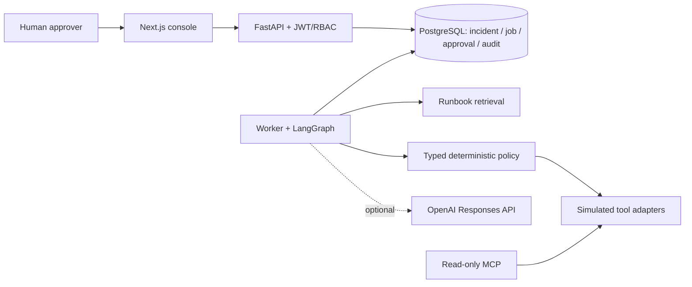

# SentinelOps

**An approval-gated incident investigation and simulated remediation platform.** SentinelOps turns an incident into a traceable decision: gather observations, retrieve runbooks, form a hypothesis, propose a permitted action, obtain human approval, execute the exact approved action, verify recovery and generate a report.

The repository is a runnable production-oriented foundation and learning project. It does not connect to real enterprise infrastructure by default. Fixture tools simulate metrics, logs, deployments, database diagnostics and mutations. Optional OpenAI reasoning consumes the same evidence; it never grants execution authority.

## Start here

If you are new to architecture, begin with [Architecture explained](docs/architecture.md), then work through [Every step: what and why](docs/learning-guide.md). These explain the building blocks, request lifecycle, project structure, infrastructure, safety and evaluation before cloud deployment.

| Question | Read |
| --- | --- |
| What does each component do? | [Architecture and diagrams](docs/architecture.md) |
| How and why is every step implemented? | [Detailed learning guide](docs/learning-guide.md) |
| Can I read all documentation in one place? | [Offline HTML guide](docs/guide.html) · [Printable PDF guide](docs/guide.pdf) |
| Where is each part of the code? | [Project structure](docs/project-structure.md) |
| What protects execution? | [Security model](docs/security.md) |
| How are results measured? | [Evaluation methodology](docs/evaluation.md) |
| How do I deploy the containers? | [Deployment guide](docs/deployment.md) |
| How do I recover failures and operate it? | [Operations guide](docs/operations.md) |
| What actually passed during this build? | [Validation record](docs/validation.md) |
| Why these design choices? | [Architecture decision records](docs/adr/) |

## What you can do

- Create and investigate an incident from four reproducible scenarios.
- Inspect evidence, a structured hypothesis, curated runbooks and a step-by-step execution trace.
- Review a proposed rollback or restart, approve/reject it as an approver, then separately request execution.
- Verify simulated recovery and inspect the report and hash-chained audit history.
- Run a measured synthetic evaluation suite and inspect its report in the console.
- Inspect a typed read-only MCP interface without exposing a second mutation route.

The default investigation mode is deterministic and requires no OpenAI key. Database saturation and uncertain evidence produce manual follow-up instead of an unsupported automatic remediation. Confidence values are uncalibrated estimates, not probability guarantees.

## Architecture





The API and worker share code and database records, not process memory. PostgreSQL owns durable state. SQLite is a single-worker native-development fallback. Runbook retrieval uses a keyword baseline; pgvector schema support is an extension point for a proper embedding ingestion/search pipeline. Redis and the telemetry collector are optional infrastructure profiles, not prerequisites for the current database-backed queue.

## Quick start with Docker

Requirements: Docker Engine/Desktop with Compose v2, enough memory for a Next.js build, and access to npm/Python/container registries. No cloud account or model key is required.

Download/extract the project onto your own computer and open a terminal in the `SentinelOps` folder containing `compose.yaml`. Docker Desktop must be running on that computer. These steps are also available with Windows and macOS/Linux examples in [Local setup and connection troubleshooting](docs/local-setup.md).

```bash
cp .env.example .env
docker compose up --build -d --wait
```

Open the console at **http://localhost:3000** and interactive API documentation at **http://localhost:8000/docs**. `localhost` means the computer running your browser: these addresses work when Docker is running on that same computer. Starting containers in a remote Codex cloud workspace does not start the app on your laptop or make cloud loopback addresses reachable there.

The browser talks directly to the API, so `NEXT_PUBLIC_API_URL` must be reachable from the browser. This setting is embedded into the frontend at build time. If you change ports in `.env`, update `NEXT_PUBLIC_API_URL` and `CORS_ORIGINS` to match and rebuild the frontend. Remote access needs a separately configured hosting or forwarding mechanism; no browser-accessible preview URL is provided by the source repository itself.

The demo identities are:

| Identity | Password | Permission |
| --- | --- | --- |
| `operator` | `sentinel-demo` | Create and investigate incidents |
| `approver` | `sentinel-demo` | Investigate, approve/reject and execute permitted remediation |

These are public local-demo credentials. The Compose demo binds web/API ports to loopback and does not publish PostgreSQL or Redis ports. Disable demo login and replace signing configuration before any shared deployment. Native configuration defaults to demo login disabled.

Compose starts PostgreSQL, runs migrations and seeds runbooks, then starts the API, worker and web app. The optional cache and collector can be started explicitly:

```bash
docker compose --profile cache --profile telemetry up -d
```

Starting those profiles does not automatically add caching or OTLP exports. Native OTEL_CONSOLE_EXPORT=true enables local console spans; production collector export and cross-process propagation remain extension work. See the deployment guide for the current integration boundaries.

Useful operations:

```bash
docker compose ps
docker compose logs -f api worker
docker compose down
```

Optional: if Python is installed on your computer, run `python infra/smoke_test.py` while the app is running to check the incident workflow. Starting the app with Docker does not require Python installed on your computer.

Ordinary `down` retains the named database volume. Do not remove volumes unless you intend to discard local incident history.

## Run natively for learning

Requirements: Python 3.12+, Node.js 22+, npm. Use SQLite and one worker for this path. Run commands from the repository root unless a `cd` is shown.

```bash
python3 -m venv .venv
source .venv/bin/activate
python -m pip install --require-hashes -r apps/api/requirements-dev.lock
python -m pip install --no-deps -e apps/api
cp .env.example apps/api/.env
cd apps/api
python -m sentinelops.migrate
python -m sentinelops.seed
uvicorn sentinelops.main:app --host 127.0.0.1 --port 8000
```

In a second terminal, activate the same environment and start the worker from `apps/api`:

```bash
source .venv/bin/activate
cd apps/api
python -m sentinelops.worker
```

In a third terminal, start the frontend:

```bash
cd apps/web
npm ci
npm run dev
```

The API and worker must use the same `DATABASE_URL`; two different SQLite files would create two isolated systems. Both read `apps/api/.env` when started from that directory. On Windows, use the corresponding virtual-environment activation command and an appropriate shell for these commands.

## Walk through one incident

1. Sign in as **operator** and create the checkout deployment-regression scenario.
2. Click **Investigate**. The API queues durable work; the worker gathers fixture observations and produces the evidence and proposal.
3. Inspect the hypothesis and the rollback proposal. Investigation stops at the policy gate and performs no mutation.
4. Sign in as **approver**, reopen the incident, enter a reason and approve the exact proposal.
5. Click **Execute**. The worker rechecks authorization and changes simulated deployment state.
6. Review verification, the final report, workflow trace and audit events.

Try database saturation or an unknown scenario next. The useful outcome may be escalation rather than an automatic action. A safe incident responder needs to recognize that difference.

## Tests and evaluations

With the Python environment active, from the root:

```bash
python -m pytest tests apps/api/tests -q
cd apps/api
python -m sentinelops.evaluate --output ../../evals/results/latest.json
```

Then open the Evaluations view. The report is generated from execution, not seeded with invented scores. The fixture corpus contains explicit telemetry and expected outcomes in separate fields; expected answers are not passed to the workflow.

Frontend checks:

```bash
cd apps/web
npm run typecheck
npm run build
```

Backend tests check policy and lifecycle behavior, including role denial, approval binding, typed tool arguments and idempotency. Evaluation metrics are synthetic fixture baseline results. They do not establish real-model accuracy, semantic retrieval quality, cloud latency or production remediation reliability. See [evaluation.md](docs/evaluation.md) and the [validation record](docs/validation.md) for the exact scope.

## Optional OpenAI reasoning

For Compose, edit the root `.env`; for native processes, edit `apps/api/.env`:

```dotenv
LLM_MODE=openai
OPENAI_API_KEY=your-server-side-key
OPENAI_MODEL=your-supported-model-id
```

Restart the API and worker after changing backend settings. For Compose, use `docker compose up -d --force-recreate api worker`. The default example model is a configurable starting point, not a guarantee of availability for your account. OpenAI mode uses structured hypothesis output from the Responses API. Production tool adapters remain disabled.

The supplied validation was run without provider credentials. Do not claim a live-agent score or token cost until you run a separately labeled provider-backed suite and record actual usage.

## Security model

Read tools are allowlisted and typed. The SQL diagnostic tool accepts named adapter-owned templates, not arbitrary SQL. `rollback_deployment` and `restart_service` require an approver and an exact matching persisted approval. `write_sql`, `delete_data` and unknown tools are blocked. API checks and worker checks enforce the boundary independently of the UI and model.

Audit records are append-only through the application ORM and hash-chained for integrity checking. This does not make the database immutable against administrators or direct SQL. Stronger retention requires database grants and external immutable storage/anchoring.

JWT signature, issuer, audience and expiry are validated. Demo login is intentionally local-only. A configurable verification key provides a token validation boundary, but enterprise OIDC login, JWKS rotation, organization mapping and browser session hardening still require deployment-specific work.

## Production deployment and remaining work

The GCP deployment guide maps the containers to Cloud Run, Cloud SQL, Secret Manager and an always-on worker. Cloud manifests are templates to review and configure, not evidence of a deployed cloud environment. No cloud resources were provisioned by this build. Terraform is a documented next step rather than a misleading empty infrastructure promise.

Before serving real customers, complete and validate:

- Enterprise identity, service/environment-scoped RBAC, tenant isolation where needed, and protected browser sessions.
- Authorized live adapters with scoped credentials, timeouts, retries, provider idempotency and ambiguous-outcome reconciliation.
- Permission-aware runbook ingestion, versioned embeddings, semantic retrieval and retrieval-specific evals if pgvector is enabled.
- Approval expiry/change windows, separation of duties, external audit retention and secret rotation.
- Production database migrations, backup restore drills, worker/concurrency tests, load tests and capacity limits.
- Exported telemetry, dashboards, alerting, SLOs and an on-call runbook.
- Staging failure exercises, deployment rollback, dependency/security review and measured live-model latency/cost.

Each item has a reason and a verification step in the [learning guide](docs/learning-guide.md) and [operations guide](docs/operations.md). This separation lets you demonstrate real engineering work without presenting simulation as production evidence.

## Recorded demonstration

These artifacts were captured from the running fixture application, rather than drawn as mockups:

- [Incident creation, approval, execution and resolution video](docs/media/incident-demo.webm)
- [Investigation trace and supporting evidence](docs/media/agent-trace.png)
- [Measured evaluation dashboard](docs/media/evaluation-dashboard.png)
- [Resolved incident report](docs/media/incident-report.png)
- [Mobile console](docs/media/mobile-console.png)

The recording and screenshots use simulated telemetry. The complete PostgreSQL container path was separately verified; see the validation record.

## Design decisions

- [Use one explicit workflow orchestrator](docs/adr/0001-explicit-workflow.md)
- [Persist work requests in the database](docs/adr/0002-database-jobs.md)
- [Approve exact actions](docs/adr/0003-approved-actions.md)
- [Build reproducible fixtures before live integrations](docs/adr/0004-fixture-first.md)

The project deliberately avoids combining multiple agent orchestration frameworks. The essential engineering decisions are who owns state, who may authorize a mutation, what survives a crash, and how an outcome is verified.
