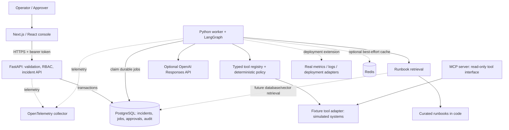
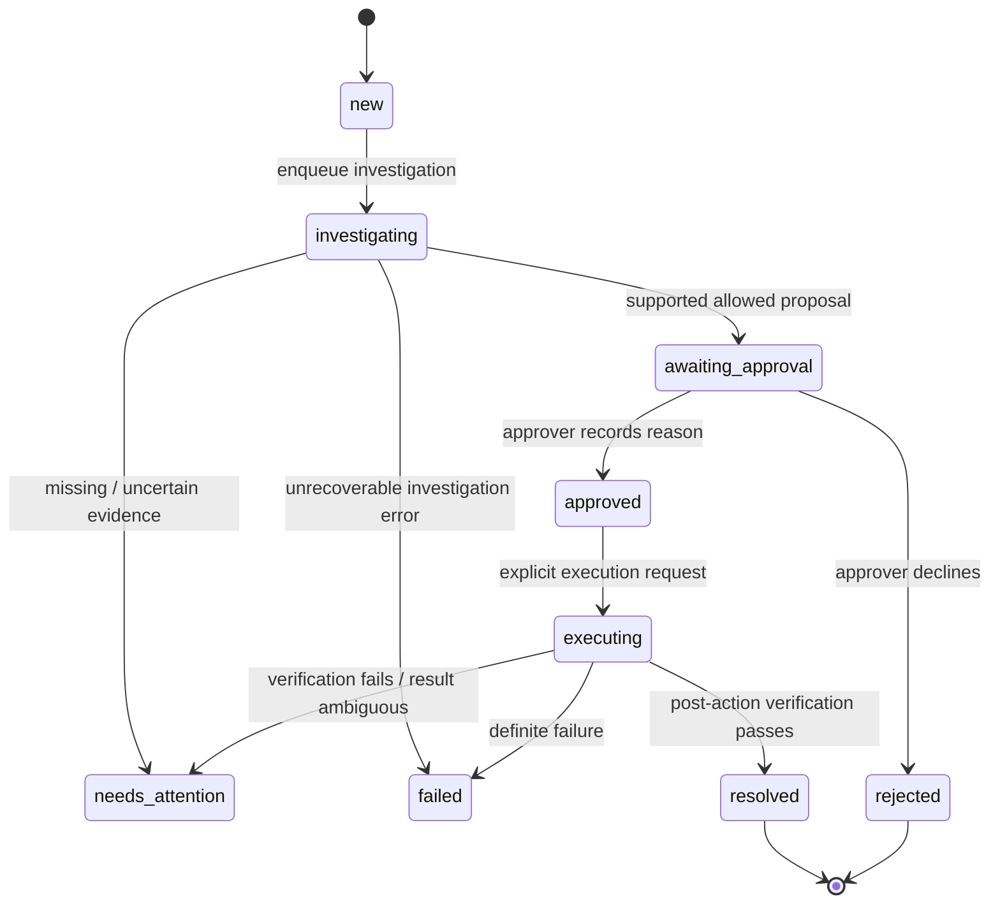
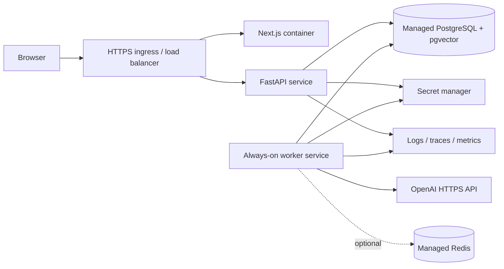

# Architecture: from an alert to a verified decision

Architecture means deciding which component owns each responsibility, how components communicate, and what happens when one fails. Choosing a framework is only one part of that decision. SentinelOps separates human interaction, trusted policy, long-running work, external observations, and durable records.

## 1. Understand the two execution paths

**Investigation is read-only.** An operator creates an incident. A worker classifies it, retrieves runbooks, reads simulated service metrics/deployments/logs, builds a hypothesis and evidence, and proposes an action. Policy evaluates that action. The result is either an approval request or a case requiring more investigation.

**Remediation crosses a trust boundary.** An approver reviews a specific proposal and records a reason. Approval does not automatically execute it. The approver then requests execution. The worker revalidates the exact approved proposal and records the outcome. Verification checks service behavior after the simulated change; a successful tool return alone cannot resolve an incident.

Dashed connections represent optional components or an extension boundary; they are not evidence that a real enterprise integration is configured. PostgreSQL is the shared operational source of truth. Runbook browsing is backed by seeded database rows; investigation retrieval currently uses the matching curated definitions in code. SQLite is a convenient single-worker local fallback. Redis must never be the sole holder of an approval or an execution request.

## 2. Why separate an API and worker?

An HTTP API should answer promptly. Investigation may spend seconds waiting for an external service and may later wait hours for a person. Keeping that work inside the incoming request makes browser disconnects, reverse-proxy timeouts and process restarts affect the workflow.

The API validates the request and persists a job. A separate worker claims it and saves results. That gives us a place to add bounded retries, job leases and execution-specific recovery. The browser polls the incident detail while work is active. A websocket would change delivery to the browser; it would not replace durable state.

The initial application uses a database job table rather than adding a second queue as another source of truth. PostgreSQL supports transactional job claims. A larger deployment can use a managed queue, but publication and consumption must account for duplicate delivery and transaction boundaries, usually with an outbox. Redis is useful for expendable cache entries, not as the authoritative job ledger.

## 3. What each technology does

| Component | Job in this project | Why it exists |
| --- | --- | --- |
| Next.js + React | Operator console and interactive incident details | People need to inspect evidence and make explicit decisions. |
| FastAPI | HTTP endpoints and dependency-based authentication | Provides typed API boundaries and generated OpenAPI documentation. |
| Pydantic | Incident, proposal and tool argument validation | Rejects malformed inputs before application logic uses them. |
| SQLAlchemy | Database access and transactions | Keeps application models coherent across PostgreSQL and the local SQLite fallback. |
| PostgreSQL | Operational records and durable jobs | Preserves state and coordinates concurrent processes. |
| pgvector | Optional runbook embedding storage/search | Supports semantic retrieval when embeddings and an index are configured. The implemented retrieval is keyword ranking over curated in-code documents; ingestion, embedding generation, vector indexing and semantic search are not implemented. |
| LangGraph | Explicit investigation steps and conditional transitions | Makes the workflow inspectable and avoids an unbounded agent loop. Lifecycle routing is handled by application code. |
| OpenAI Responses API | Optional evidence-grounded hypothesis generation | Provides reasoning assistance; the model has no authority to approve or execute tools. |
| MCP | Typed external tool interface | Lets integrations be exposed consistently, while application policy remains the enforcement point. |
| Redis | Optional short-lived cache | Can reduce repeated reads; losing cache data must not lose incident progress. |
| OpenTelemetry | Workflow span hooks and an optional receiver scaffold | Stored workflow traces work locally; OTEL_CONSOLE_EXPORT=true enables local console spans. OTLP exports and cross-process request/job trace propagation are not wired in this version. |
| Docker Compose | Local multi-process environment | Makes the API, worker, web app and PostgreSQL run with known dependencies. |
| GitHub Actions | Repeatable checks on changes | Prevents known test/build regressions from reaching the main branch. |

## 4. Workflow diagram

An approval is a database record, not a message to the model. Worker execution is a separate operation. The compiled graph currently has a bounded sequential investigation path that ends at policy. The worker maps its result to the lifecycle states above. The application persists user-visible state at job boundaries; do not confuse this with a fully configured LangGraph checkpointer that can resume inside any node after a crash.

## 5. The data model and consistency rules

- **Incident:** the alert, service, severity and current lifecycle status.
- **Investigation result:** hypothesis, evidence and trace entries.
- **Proposal:** exact tool name and arguments plus a canonical fingerprint.
- **Approval:** approver identity, reason and the proposal fingerprint it authorizes.
- **Job:** durable request, claim/lease metadata and terminal outcome.
- **Audit event:** actor, event, timestamp, payload and integrity-chain hash.
- **Runbook:** service guidance and optional embedding for retrieval.

The important invariant is: an execution refers to an approval for the same proposal content, in the same incident, with the required role. Updating arguments after approval invalidates the approval. Another invariant is that repeating an execution request must not apply the same action twice. The application uses idempotency records and persisted state to enforce this for its simulated adapters. Real integrations must support their own idempotency or reconciliation too.

SQL transactions group changes that must agree. For example, approving a proposal and writing its audit event should commit together. Locks coordinate concurrent requests. Hashing an action does not replace those database controls.

## 6. Trust boundaries

1. **Browser to API:** the browser is untrusted. API validation and authorization apply even if someone bypasses the interface.
2. **Model output to policy:** model output is untrusted data. It must match a typed schema and a tool allowlist. Retrieved runbooks and logs are untrusted too; text inside them cannot grant permissions.
3. **Policy to adapter:** every mutation requires a valid approval at execution time. High-risk tool credentials should be isolated from read-only tools.
4. **Application to database:** an ordinary application user must not update/delete audit events. A database administrator remains powerful; external immutable retention is required for stronger guarantees.
5. **Service to provider:** credentials stay server-side; production egress should restrict destinations and tool scopes.

The fixture adapter deliberately changes simulated state only. The project does not connect to your production deployment or database, and an OpenAI key does not enable live remediation.

## 7. Local and cloud infrastructure are different

Compose runs these processes on one developer machine. Cloud Run or ECS runs the containers under a managed scheduler. Managed PostgreSQL supplies backups, high availability options and database operations; container orchestration alone does not. The polling worker requires CPU while idle, a minimum running instance and a clear concurrency model. A request-only scale-to-zero service is unsuitable for the current polling worker. See [deployment.md](deployment.md) for the concrete GCP path and [operations.md](operations.md) for recovery procedures.

## 8. Design trade-offs

**One application database first.** This simplifies consistency but makes the database part of both request and worker availability. Monitor connections and queue depth. Split analytical history or vector search only when workload evidence justifies it.

**Deterministic policy around a probabilistic model.** The model can assist diagnosis. Approval requirements, permission checks and forbidden operations must be deterministic code that remains effective when the model is wrong.

**A fixture environment before live adapters.** This makes the workflow reproducible and safe to demonstrate. It does not prove that a real rollout system, metrics source or database behaves correctly. Contract tests and staged failure injection are required for each integration.

**Explicit state over framework accumulation.** LangGraph is the single workflow orchestrator. Responses API is the model interface. MCP is a tool protocol. Adding another orchestration SDK would add competing state and recovery semantics without solving a current requirement.
