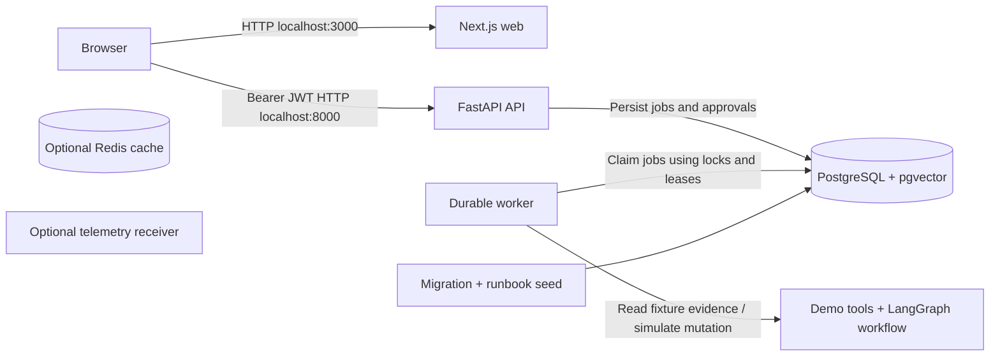
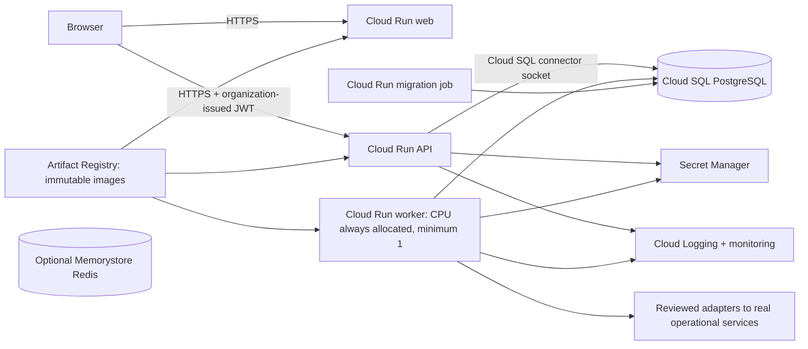

# Run and deploy SentinelOps

The supplied implementation runs a complete local demonstration: browser, API,
durable investigation/execution worker, PostgreSQL and approval workflow. It uses
simulated operational evidence and mutations by default. A production deployment
needs an identity provider, real read-only adapters, reviewed remediation adapters
and operations controls. No cloud resources have been created by this project.

## 1. Understand what runs where

| Component | Local runtime | Purpose and reason |
| --- | --- | --- |
| Browser UI | Next.js, port 3000 | Lists incidents, shows evidence and lets authorized humans review proposals. |
| API | FastAPI, port 8000 | Validates input, authenticates callers, enforces roles and saves state. |
| Worker | Separate Python process | Runs slow investigations and approved execution without occupying an HTTP request. |
| PostgreSQL | PostgreSQL 16 with pgvector | Persists incidents, jobs, proposals, evidence and audit events across process restarts. |
| Migration task | One-off Python process | Installs versioned schema changes before API/worker start. Seeds runbook content. |
| Redis | Optional `cache` profile | Future cache/rate-limit infrastructure; the current queue does not use Redis. |
| OpenTelemetry collector | Optional `telemetry` profile | Receiver scaffold for future instrumentation; current workflow traces are database records. |



The browser connects directly to the API. `NEXT_PUBLIC_API_URL` must therefore be
an address the browser can reach; `http://api:8000` is only a Docker network address
and will not work from a host browser. Next.js embeds `NEXT_PUBLIC_*` values during
the build, so changing an API URL requires rebuilding the web image.

## 2. Install the local prerequisites

Use Git and Docker Engine/Desktop with Compose v2. The native alternative needs
Python 3.12 and Node.js 22. Docker provides consistent PostgreSQL, Python and Node
runtimes without installing each database/runtime on your machine. Your machine
needs access to npm, PyPI and container registries for the first build.

## 3. Choose explicit local configuration

From the repository root:

```bash
cp .env.example .env
docker compose config --quiet
```

The sample contains clearly labeled development credentials. `DEMO_MODE=true`
enables `operator` and `approver` accounts with password `sentinel-demo`;
`LLM_MODE=fixture` uses deterministic fixture reasoning without a paid model key.
All live mutations remain disabled. Configuration validation catches malformed
Compose before building; `--quiet` avoids displaying rendered credential values.

The checked-in signing key is long enough for the demo but is public knowledge.
It does not provide security for an Internet-facing service. Keep the default
loopback bindings while using demo credentials. Changing the password in `.env`
does not change credentials inside an already initialized PostgreSQL volume; use
an explicit database password rotation or reset the local volume.

## 4. Build and start the full stack

```bash
docker compose up --build -d --wait
```

Compose waits for PostgreSQL, runs the schema migrations and runbook seed, then
starts API, worker and web. Health checks verify API database readiness, worker
process liveness and the frontend HTTP response. `make up` is the same command.

Open `http://localhost:3000`. API documentation is at
`http://localhost:8000/docs`. Only web/API ports are published by default, both on
loopback. PostgreSQL and Redis stay on the private Compose network. The PostgreSQL
named volume survives ordinary stops; the optional Redis volume is a cache volume.
Source code is baked into images, so code changes require a rebuild.

## 5. Verify the complete workflow

```bash
python infra/smoke_test.py
```

This script uses the HTTP API to create a checkout incident, waits for the worker,
checks the expected hypothesis, confirms an operator cannot approve, approves as
the approver, queues execution and checks simulated resolution. It repeats the
same execution key to exercise idempotency. It leaves one labeled test incident in
the demo database so you can inspect its evidence and audit trail in the UI.

This is different from a page-load check: it verifies that the queue, worker,
policy and database cooperate through their real service boundary.

## 6. Run tests and measured evaluations

For native developer tooling, create the virtual environment in `work/`:

```bash
python3.12 -m venv work/venv
. work/venv/bin/activate
python -m pip install --require-hashes -r apps/api/requirements-dev.lock
python -m pip install --no-deps --no-build-isolation -e apps/api
python -m pytest tests apps/api/tests -q
cp .env.example apps/api/.env
cd apps/api
python -m sentinelops.evaluate --output ../../evals/results/latest.json
```

The runtime and developer lockfiles pin the same runtime versions and include
artifact hashes. The developer lock adds test tooling. CI installs those exact
dependencies, runs both test suites and measured fixture evaluations, checks
TypeScript, builds Next.js, then builds/runs the complete Compose stack and smoke
test. The fixture evaluation report measures this simulated baseline; it is not a
claim about model accuracy against real incidents.

Compose mounts `evals/results/` read-only into the API, so a newly generated report
is available through the evaluations endpoint without rebuilding the API image.
The mounted directory must exist and have host-readable permissions. A cloud
image includes the report present at image build time instead of this local mount.

## 7. Run without Docker when learning each process

After installing the locked Python dependencies, copy `.env.example` into
`apps/api/.env`. That location matters: settings read `.env` relative to the process
working directory. The copied sample selects SQLite, disables pgvector and points
evaluations to the root report.

In separate terminals, activate the same virtual environment and run:

```bash
# Terminal 1, from apps/api
python -m sentinelops.migrate
python -m sentinelops.seed
uvicorn sentinelops.main:app --host 127.0.0.1 --port 8000

# Terminal 2, also from apps/api
python -m sentinelops.worker

# Terminal 3, from apps/web
npm ci
npm run dev
```

SQLite is a convenient single-machine fallback. It is not the deployment choice
for concurrent API/worker replicas; PostgreSQL row locking is necessary for that
mode. The same worker/application separation is retained even in native mode.

## 8. Stop, inspect, or intentionally reset

```bash
docker compose logs --tail=100 api worker migrate
docker compose down
```

Ordinary `down` keeps database data. `docker compose down --volumes` intentionally
deletes local database/cache data; use it only when you want a fresh demo. See
`operations.md` for failure recovery and backup guidance.

## Production architecture on Google Cloud



Cloud Run supplies HTTPS and managed container scheduling. Cloud SQL supplies a
managed PostgreSQL database with backup/PITR options. Artifact Registry holds
versioned container images. Secret Manager supplies credentials without putting
them in git or browser bundles. Separate service accounts limit each component's
cloud permissions. These are infrastructure capabilities, not substitutes for
application approval checks or evidence quality.

The database-polling worker cannot use request-only CPU or scale to zero: no
incoming HTTP request wakes it when an API inserts a database job. Its template
sets CPU always allocated and a minimum of one instance. The included
`infra/worker_service.py` wrapper starts the worker and binds Cloud Run's `PORT`
for health checks. This adds an always-running worker cost. A later queue-triggered
design could use Cloud Tasks/Pub/Sub with an explicit delivery/lease contract;
those integrations are not implemented here.

## Production prerequisites, in order

1. **Identity:** disable demo login, configure an organization token issuer and
   RS256 public verification key, and map signed `sub`/`role` claims to the allowed
   roles (`viewer`, `operator`, `approver`). Tokens must also contain `iat`, `nbf`,
   `exp`, matching `iss` and `aud=sentinelops-api`. The sample UI currently supports
   demo login, so a real SSO/token acquisition flow must be added before deployment
   is useful to end users. Never give the API an identity provider's private key.
   JWKS fetching/automatic key rotation is not implemented.
2. **Live evidence adapters:** replace fixture evidence with scoped monitoring,
   logs, deployment and read-only database adapters; test access in staging.
3. **Remediation adapters:** implement allowlisted typed live operations, upstream
   idempotency/reconciliation and least-privilege credentials. The existing live
   mode fails closed. Setting an environment flag does not create these adapters.
4. **Database and IAM:** choose project/region, create Cloud SQL PostgreSQL 16,
   database roles, backup retention and service accounts. Use an owner/migration
   database account for DDL and a restricted runtime account for normal DML.
5. **Operational controls:** review load/cost limits, alerting, data retention,
   encrypted external audit retention and restore drills. A database hash chain
   alone does not stop an administrator rewriting history.

The supplied manifests deliberately set `DEMO_MODE=false` and
`LIVE_TOOLS_ENABLED=false`. They are a deployment scaffold for completing these
prerequisites, not a claim that the prototype is production-ready.

## Reviewable Cloud Run deployment steps

These commands describe actions to run in your own authorized GCP deployment
session. They have not been executed against a cloud project here.

1. Create an Artifact Registry Docker repository and Cloud SQL instance in your
   chosen region. Enable Cloud Run, Artifact Registry, Cloud SQL Admin and Secret
   Manager APIs. Create API, worker, web and migration service accounts. Grant
   API/worker/migration `roles/cloudsql.client`; grant secret access only to each
   account's relevant secret. The web account needs no SQL or credential access.
   Cloud SQL IAM grants connector access; PostgreSQL role privileges independently
   control what SQL that connection can execute. If your instance uses only a
   private IP, add the required VPC/Direct VPC egress configuration; the supplied
   socket annotation alone does not configure that network path.
2. Create database users/roles. Use a separate migration database owner and a
   runtime role with only the required table privileges. Grant runtime privileges
   after initial migrations and maintain those grants for future tables. Install
   the supported `vector` extension as the database owner if you intend to develop
   embedding retrieval; baseline retrieval works without it.
3. Store runtime and migration database connection strings in separate Secret
   Manager secrets. A Cloud SQL Unix socket DSN has this form; URL-encode username
   and password characters before constructing it:

   ```text
   postgresql+psycopg://USER:URL_ENCODED_PASSWORD@/sentinelops?host=/cloudsql/PROJECT:REGION:INSTANCE
   ```

   Store the IdP RS256 public key in the verification-key secret. Use explicit
   secret version numbers for repeatable releases. Do not paste secrets into
   rendered YAML or command histories.
4. Build and push the API image and web image. The web build must know the final
   public API origin; reserve/map a stable origin or obtain the API service URL
   before building web. Prefer immutable image digests in manifest variables:

   ```bash
   export API_BUILD_TAG='REGION-docker.pkg.dev/PROJECT/REPOSITORY/api:RELEASE'
   export WEB_BUILD_TAG='REGION-docker.pkg.dev/PROJECT/REPOSITORY/web:RELEASE'
   export API_ORIGIN='https://YOUR-API-ORIGIN'
   gcloud auth configure-docker "$REGION-docker.pkg.dev"
   docker build -f apps/api/Dockerfile -t "$API_BUILD_TAG" .
   docker push "$API_BUILD_TAG"
   docker build --build-arg NEXT_PUBLIC_API_URL="$API_ORIGIN" -t "$WEB_BUILD_TAG" apps/web
   docker push "$WEB_BUILD_TAG"
   ```

5. Resolve the pushed image digests in Artifact Registry, then set non-secret
   variables for immutable image references, resource IDs and version numbers:

   ```bash
   export API_IMAGE='REGION-docker.pkg.dev/PROJECT/REPOSITORY/api@sha256:DIGEST'
   export WEB_IMAGE='REGION-docker.pkg.dev/PROJECT/REPOSITORY/web@sha256:DIGEST'
   export CLOUD_SQL_CONNECTION_NAME='PROJECT:REGION:INSTANCE'
   export API_SERVICE_ACCOUNT='sentinelops-api@PROJECT.iam.gserviceaccount.com'
   export WORKER_SERVICE_ACCOUNT='sentinelops-worker@PROJECT.iam.gserviceaccount.com'
   export WEB_SERVICE_ACCOUNT='sentinelops-web@PROJECT.iam.gserviceaccount.com'
   export MIGRATION_SERVICE_ACCOUNT='sentinelops-migrate@PROJECT.iam.gserviceaccount.com'
   export DATABASE_SECRET_VERSION='1'
   export MIGRATION_DATABASE_SECRET_VERSION='1'
   export JWT_KEY_VERSION='1'
   export JWT_ISSUER='https://YOUR-IDENTITY-ISSUER'
   export WEB_ORIGIN='https://YOUR-WEB-ORIGIN'
   python infra/gcp/render.py --output work/gcp-rendered
   ```

6. Review the rendered manifests. Create/execute the migration job before serving
   traffic, then deploy API, worker and web in that order:

   ```bash
   gcloud run jobs replace work/gcp-rendered/migrate.job.yaml --region "$REGION" --project "$PROJECT_ID"
   gcloud run jobs execute sentinelops-migrate --wait --region "$REGION" --project "$PROJECT_ID"
   gcloud run services replace work/gcp-rendered/api.service.yaml --region "$REGION" --project "$PROJECT_ID"
   gcloud run services replace work/gcp-rendered/worker.service.yaml --region "$REGION" --project "$PROJECT_ID"
   gcloud run services replace work/gcp-rendered/web.service.yaml --region "$REGION" --project "$PROJECT_ID"
   ```

7. Set invocation IAM deliberately. The direct-browser design requires publicly
   reachable web/API at the Cloud Run layer, while the API still enforces JWTs.
   An organization requiring Cloud Run IAM/IAP must add a trusted session/token
   proxy or compatible gateway flow; browser app JWTs do not automatically satisfy
   Cloud Run IAM. Keep the worker internal with no public invoker permission.
8. Check readiness, submit a staging incident using real signed tokens, verify
   role denial/approval, and confirm the worker processes jobs while receiving no
   requests. Confirm backup restore, alert delivery and identity key rotation
   before sending production traffic. Do not run the demo smoke script against a
   production service; demo login must be disabled there.

Memorystore Redis is optional and unused by this implementation. If future code
uses it, add private networking/Direct VPC egress, authentication where supported,
memory limits and cache eviction policy. Do not introduce an extra managed service
solely because a reference diagram contains Redis.

Terraform is a suitable later layer for provisioning project services, IAM, SQL,
Secret Manager references, registries and networking. Region, availability, budget
and retention must be chosen first; the included Cloud Run YAML templates do not
claim to provision that entire platform or to have passed a cloud apply.
